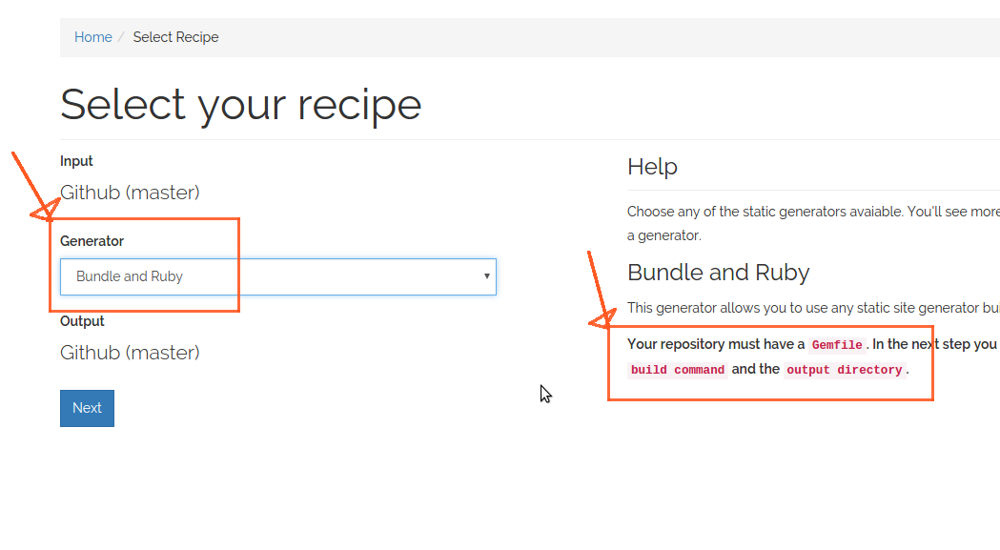
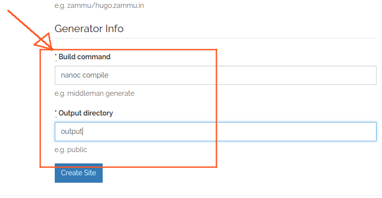

# Build your own static site generator using Ruby

Zammu now has the ability to support any Ruby based static site generator. You
can now select the 'Bundle and Ruby' in the first step, and fill out the build
command and the output directory in the second step to configure it.

In the following example I am using nanoc to build my websites.

Happy building :)

P.S: I built a small TIL builder to collaborate on TILs among small teams, check
it out here: http://til.zammu.in/ The source for this repository is at: https://github.com/minhajuddin/til
